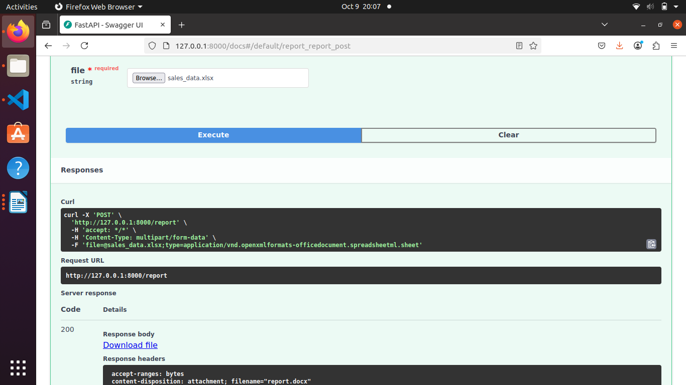
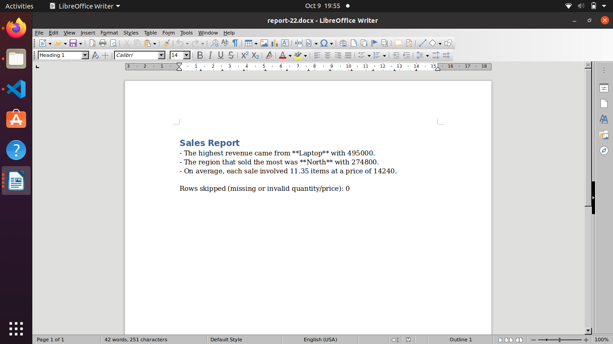
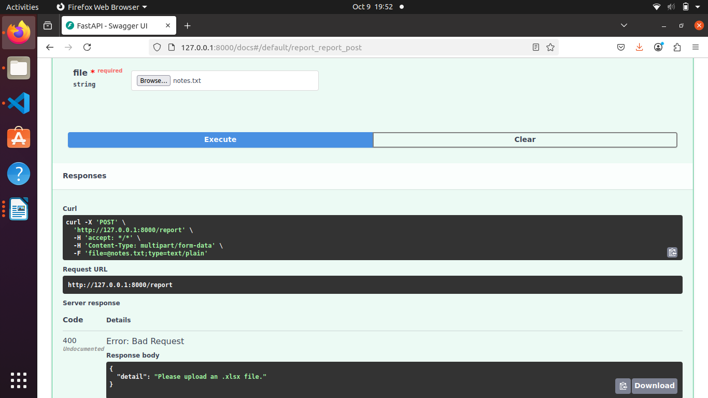

# Excel Report Agent

Upload an Excel sales file and get a Word report with AI-written insights.

## How it works

1) Checks the file for an empty sheet or missing required columns, and stops with a clear message if something is wrong.
2) Calculates revenue (quantity x price) by product and region with pandas.
3) An LLM (Groq) turns those numbers into a short written report, saved as a Word file.

## How to run

Requires Python 3.12

1) Install the libraries from the requirements.txt:

```
pip install -r requirements.txt
```
2) Create a file named `.env` in the project folder, with this line inside (use your own Groq API key):

```
GROQ_API_KEY=your_key_here
```
3) Start the app:

```
uvicorn graph_excel_api:app --reload
```

4) Open http://127.0.0.1:8000/docs, try POST /report, and upload an Excel file


## Demo 

1) Uploading an Excel file in the API docs, in the file required field.



2) Getting the output as a download option. 



3) Getting an error message when uploading an unsupported file.

